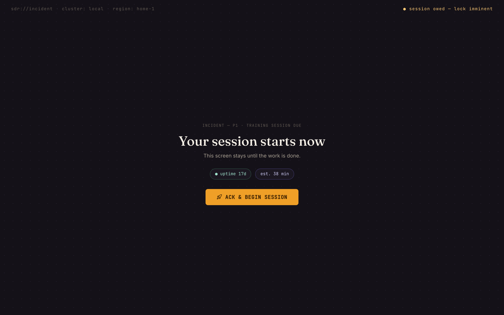
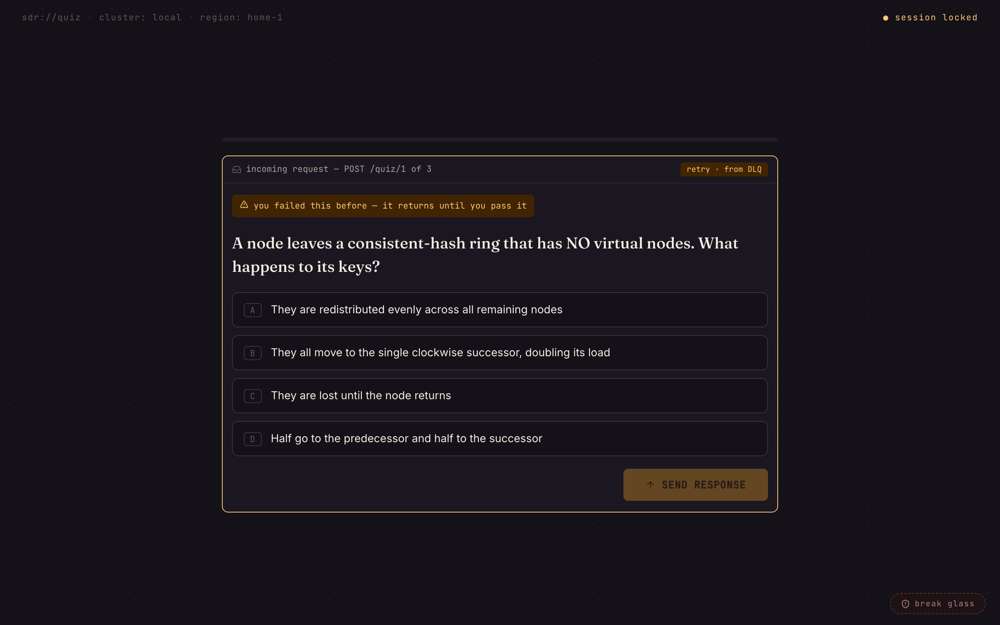
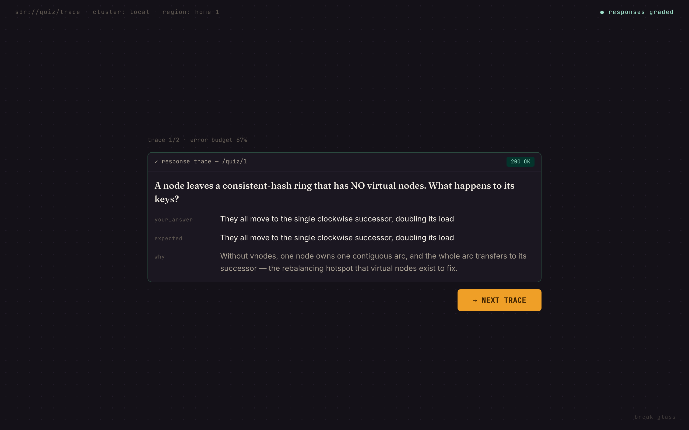
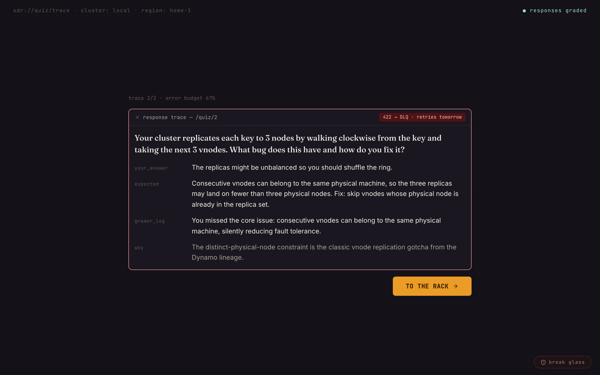
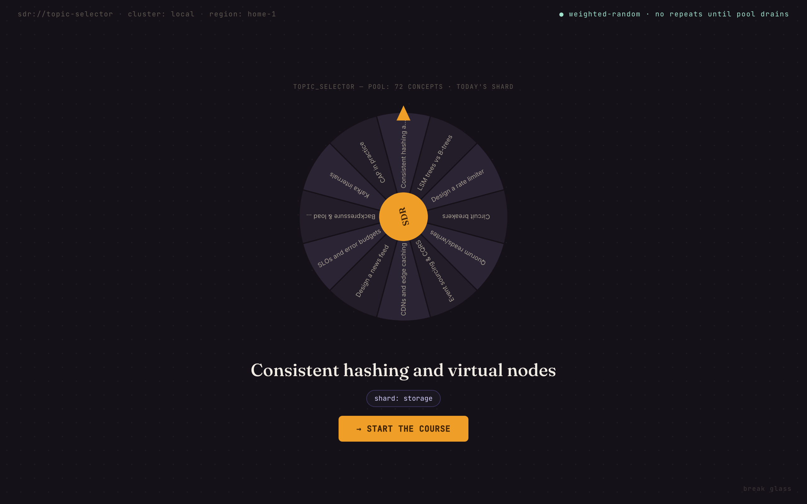
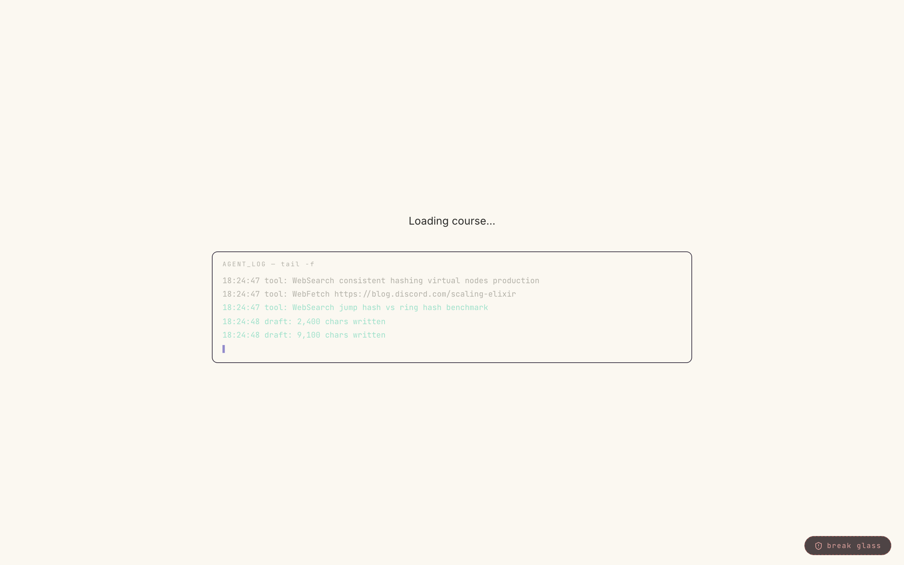
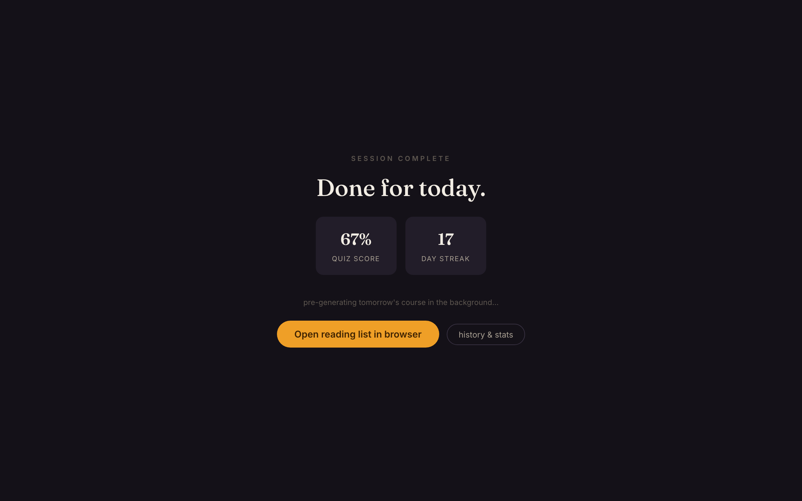
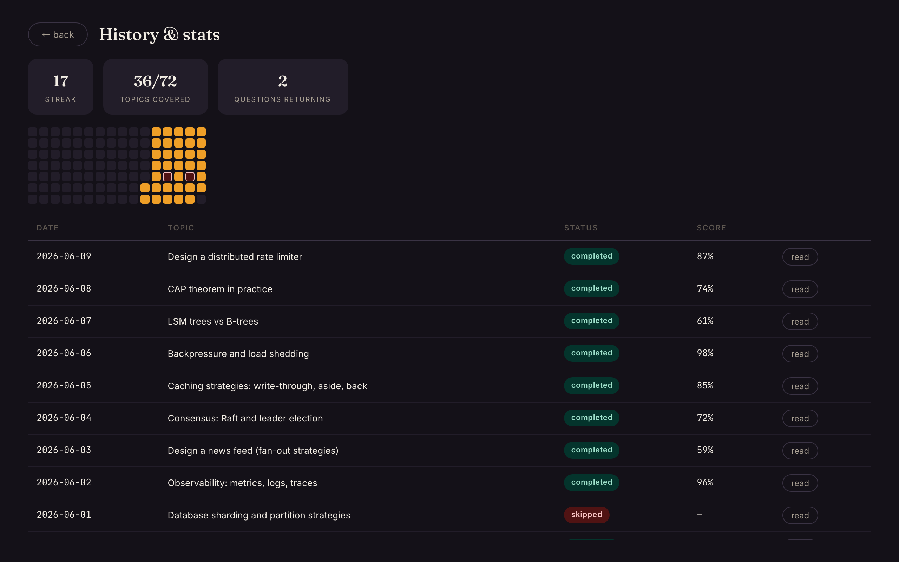
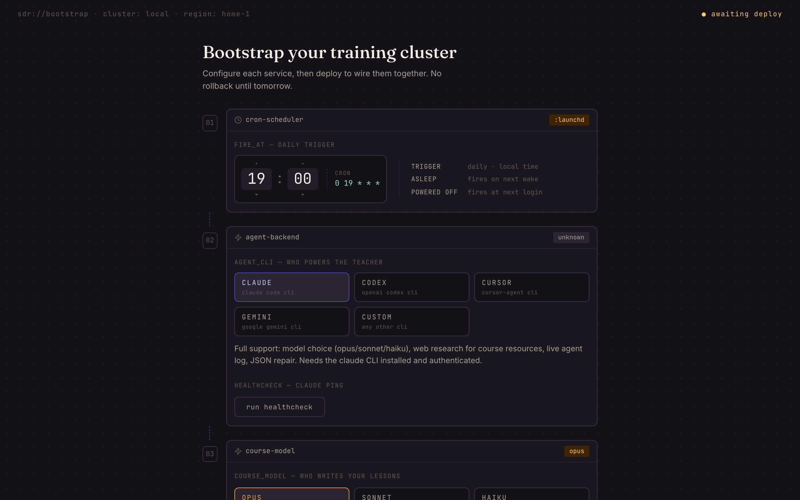

# System Design Roulette

**A macOS app that hijacks your laptop once a day and forces you to get better at system design.**

AI is absorbing more of the routine coding work every month. The skill that compounds is judgment — architecture, trade-offs, system design. This app makes sure you practice it daily, whether you feel like it or not.

At a time you choose, your screen is taken over — full-screen, above the menu bar, immune to Cmd+Tab, Cmd+Q, and Force Quit — until you finish a ~38-minute session: a quiz on yesterday's topic, a roulette spin that picks today's, and a 30-minute course generated on the spot by your own AI agent, with real engineering resources from the web.



## The daily loop

### 1 · Quiz on yesterday's course

Every session opens with a quiz on what you read yesterday — multiple choice plus free-text. Free-text answers are graded by your agent against a rubric. Questions you failed earlier come back, badged, until you pass them.



### 2 · Review your answers

Every question shows your answer, the model answer, grader feedback, and an explanation that teaches. Failed questions are flagged **returns tomorrow** and added to the next quiz — spaced repetition of exactly the things you got wrong.





### 3 · Spin the wheel

A roulette wheel picks today's topic from a pool of 72 system design concepts across 8 categories — fundamentals, storage, caching, messaging, resilience, architecture, security, operations, plus classic case studies. No topic repeats until the whole pool is exhausted.



*(The spin is theater — the topic is drawn server-side when tomorrow's content pre-generates, so the course is ready the moment the wheel stops.)*

### 4 · Read the course — 30 minutes, enforced

A 3,500–4,500-word course generated by Claude with web-searched resources (engineering blogs, papers, talks). The reader switches to a calm paper theme for eye comfort. The **Complete session** button stays disabled until the 30-minute timer hits zero. Links are intercepted during the session and open in your browser afterward.



### 5 · Done — and tomorrow is already loading

Score, streak, and a category tease for tomorrow. The moment you finish, tomorrow's course and quiz start generating in the background.



### Track everything

GitHub-style heatmap, per-day scores, carryover queue, and every past course readable in the archive.



## The hijack

This is the point of the app. During a session:

- The window is **full-screen at screensaver window level** (above the Dock and menu bar) on every Space.
- macOS kiosk presentation options disable **Cmd+Tab, Cmd+H, Force Quit, and Quit/Log Out/Shut Down**.
- A 300 ms **focus re-grab loop** yanks focus back from Spotlight, Mission Control, notification clicks — anything that briefly steals it.
- Extra displays are covered with **black blanker windows**.
- Closing the window and quitting the app are blocked at the Tauri event level.

### The only ways out

1. **Finish the session.** ~38 minutes.
2. **The escape phrase.** A dim "emergency exit" link reveals a long phrase rendered as non-copyable SVG (paste disabled). Type it exactly and today is marked **skipped** — and your streak resets. Three wrong attempts locks the input for 60 seconds.
3. **The dev back door.** `touch ~/sdr-unlock` releases the lock within a second. Delete this code path if you want no mercy; keep it if you value your laptop during development.

Force-shutdown doesn't help: interrupted sessions resume at the exact step (even mid-quiz, answers persisted per question) on next launch.

## Content generation — your agent, no API keys

Courses, quizzes, and grading are generated by shelling out to the **Claude Code CLI** in headless mode (`claude -p`), authenticated by your existing subscription. No API keys to manage.

```
claude (2 attempts + JSON repair pass)
  → codex exec (fallback)
    → bundled offline courses (last resort — the session never blocks)
```

- **Course**: generated with WebSearch enabled; 4–6 real, live resources required.
- **Quiz**: generated from the stored course text, no tools.
- **Grading**: free-text answers batch-graded against an explicit rubric; MCQs grade locally in Rust. If grading fails entirely, you self-assess against the model answer — generation failures never hold your laptop hostage.
- **Pre-generation**: tomorrow's content generates the moment today's session completes (and retries hourly via a job queue), so the roulette reveal is instant.

## Scheduling

A launchd LaunchAgent (`~/Library/LaunchAgents/com.darkmatter.system-design-roulette.plist`) fires the app at your chosen time daily:

- Scheduled time missed while **asleep** → fires on wake.
- Missed while **powered off** → fires at next login (`RunAtLoad`) — the app checks "is a session owed?" on every launch and every 60 s.
- Already running → an in-app watcher engages the lock at the scheduled minute.
- Changing the time in-app rewrites and reloads the agent.

## Install

### Prerequisites

- macOS 13+
- [Claude Code CLI](https://claude.com/claude-code) installed and authenticated (`claude -p "ping"` should work). Optional: OpenAI Codex CLI as fallback.
- To build: Rust 1.80+, Node 20+.

### Build from source

```bash
git clone https://github.com/dark-matter08/system-design-roulette.git
cd system-design-roulette
npm install
npm run tauri build -- --bundles app
cp -R "src-tauri/target/release/bundle/macos/System Design Roulette.app" /Applications/
```

Launch it, complete the setup wizard (session time, escape phrase, agent check), and it's armed. Day-1's course generates immediately so your first session starts instantly.



> **Heads-up:** the app is ad-hoc signed. First launch may require right-click → Open, or `xattr -dr com.apple.quarantine "/Applications/System Design Roulette.app"`.

## Architecture

```
┌──────────────────── Svelte 5 webview (dumb renderer) ─────────────────────┐
│  SetupWizard · Idle · Quiz · AnswerReview · Roulette · CourseReader ·     │
│  Completion · Dashboard   (screens keyed off Rust-pushed session state)   │
└────────────────────────────────────┬──────────────────────────────────────┘
                          invoke / events (typed IPC)
┌────────────────────────────────────┴──────────────────────────────────────┐
│  Rust core (all authority lives here — the webview can't bypass it)       │
│                                                                            │
│  session.rs    authoritative FSM: quiz → review → roulette → course → done│
│  kiosk.rs      NSWindow level 1000, presentation options, refocus loop,   │
│                multi-display blankers                                      │
│  generator.rs  claude -p / codex spawn, JSON repair, fallback chain       │
│  scheduler.rs  launchd plist install, owed-session logic                   │
│  db.rs         SQLite: sessions, courses, questions, attempts, carryover, │
│                generation job queue                                        │
│  roulette.rs   weighted draw, no repeats until pool exhausts               │
│  timer.rs      authoritative 30-min reading timer (persisted, resumable)  │
└────────────────────────────────────────────────────────────────────────────┘
```

Design principle: **Rust owns all authority.** The timer, the lock, the state machine, and grading all live in the backend; the webview renders and requests transitions, which Rust validates. Reloading or inspecting the webview gains you nothing.

Data lives in `~/Library/Application Support/com.darkmatter.system-design-roulette/` — a SQLite database plus every course mirrored as a markdown file under `courses/` for grepping.

## Development

```bash
npm run tauri dev          # full app against a dev server
npm run dev                # frontend only, in a browser — demo mode with mock data
npm run check              # svelte-check
cd src-tauri && cargo test # core-loop integration tests (carryover, roulette, streaks)
```

Useful flags and env vars:

| Flag / env | Effect |
|---|---|
| `--debug-day` | 30-second course timer, no kiosk lock, schedule ignored — a full day in ~2 minutes |
| `--triggered` | What launchd passes; goes straight to the owed-session check |
| `SDR_DATE=2026-06-12` | Override "today" — simulate multi-day carryover flows |
| `SDR_CLAUDE_BIN=/path` | Override the claude binary (point at `/nonexistent` to test fallbacks) |
| `SDR_CODEX_BIN=none` | Disable the codex fallback |
| `SDR_MODEL=sonnet` | Override the course-generation model (default: `opus`, falls back to `sonnet` on retry) |
| `SDR_SESSION_TYPE=pop_quiz` | Force tomorrow's planned session type (skips the planner call) |
| `touch ~/sdr-unlock` | Instantly release the kiosk lock |

Demo mode: opening the frontend in a plain browser (no Tauri) automatically serves canned data from `src/lib/mock.ts` — every screen is reachable (`?step=done`, `?setup`, `?step=quiz&type=pop_quiz`) without the Rust backend. That's how the screenshots in this README were taken.

## The Teacher

The generation layer is a persistent teaching agent — see [docs/TEACHER.md](docs/TEACHER.md) for the full spec. In short: a per-concept **mastery ledger** (unseen → introduced → practicing → mastered → maintenance, with struggling/decayed detours) is compiled into a one-page **dossier** prepended to every agent call, so each course builds on what you know and attacks recorded misconceptions. The grader writes private **teacher notes** per concept that resurface next encounter. The wheel is a **progressive curriculum** — concepts unlock when ~70% of their prerequisites have been quizzed, so the pool grows from ~14 fundamentals to all 72 topics. A **nightly planner** occasionally schedules a pop-quiz audit day instead of a lesson, and after any completed session you can voluntarily **extend** with one more topic (no lock). Finish reading early? The **exit check** — 3 fresh MCQs on today's course — unlocks the TTL if you go 3/3 (60s cooldown per miss). **Audio mode** turns the course into a two-host dialogue: 🎧 listen renders it with system voices instantly, or run `scripts/provision-vibevoice.sh` for the VibeVoice (mlx-audio) quality tier rendered overnight. During the lock, secondary displays run the **chaos lab** — a live traffic simulation where you can kill nodes and watch failover — and all media players are paused and system audio muted.

## Roadmap

- [ ] **Hard mode** — CGEventTap (Accessibility permission) to truly swallow Cmd+Tab/Spotlight instead of out-racing them
- [ ] Custom topic pools / import your own syllabus
- [ ] Difficulty progression per category based on quiz history
- [ ] Notarized builds

## License

[MIT](LICENSE)
